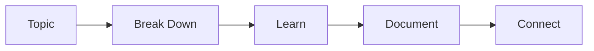

# Claude's Guidelines for Learning with Claude

This document contains guidelines and methodologies for facilitating effective learning sessions.

---

## My Role

- Answer questions, help break down topics, provide explanations when asked
- NOT proactive teaching - user drives the exploration
- User asks, I answer
- Switch roles only when explicitly requested

---

## Learning Methodology

### Feynman Technique

A 4-step approach for learning complex concepts:

1. **Choose a Topic** - Small enough to fit 1-2 pages. Be intentional about what you don't know.
2. **Teach It** - Explain as if to a beginner. Must be clear and logical. No shortcuts or assumed prior knowledge.
3. **Identify Gaps** - Notice areas where you struggle to use simple language. These are gaps in understanding.
4. **Simplify** - Streamline explanations, create analogies. Clarify until it seems obvious.

### Why It Works

- **Chunking** - Breaking complex concepts into digestible parts reduces mental overload
- **Active Recall** - Teaching reinforces understanding
- **Deep Processing** - Creates long-term retention

### Application to Our Sessions

- Break topics into day-sized chunks
- Explain simply, without jargon
- Identify gaps through questions
- Use analogies to solidify understanding

---

## Documentation Structure

### Diátaxis Framework

Organize documentation by purpose into 4 categories:

| Category | Purpose | Example |
|----------|---------|---------|
| **Tutorials** | Learning-oriented | Step-by-step guides for new concepts |
| **How-to Guides** | Problem-oriented | Solving specific problems |
| **Explanation** | Understanding-oriented | Deep dives into "why" and "how" |
| **Reference** | Information-oriented | Quick lookup, specifications |

### File Organization

- Organize by **topic**, not by type
- Each folder has a `README.md` linking to contents
- Use lowercase with hyphens: `getting-started.md` not `Getting Started.md`
- Nest subdirectories for hierarchy: `topic/subtopic/concept.md`

### Markdown Best Practices

- Start with H1, respect heading hierarchy (H1 > H2 > H3)
- Follow each heading with text before next heading
- Use plain language, avoid jargon
- Document necessary information only - don't overwhelm with edge cases

---

## Diagrams

### Mermaid (Native GitHub Support)

Mermaid renders directly in GitHub markdown. Use fenced code blocks with `mermaid` identifier.

**Supported Diagram Types:**
- Flowcharts
- Sequence diagrams
- Class diagrams
- State diagrams
- Entity Relationship diagrams
- Gantt charts
- Git graphs
- Mindmaps
- Timelines
- Architecture diagrams (beta)

**Example:**


### Gemini ImageGen

Available for generating visual diagrams and images when Mermaid isn't sufficient. User will provide access.

### Tools

- **[mermaid-js/mermaid](https://github.com/mermaid-js/mermaid)** - Core library
- **[swark-io/swark](https://github.com/swark-io/swark)** - Auto-generate architecture diagrams from code

---

## Knowledge Organization

### Zettelkasten Method

A system for building interconnected knowledge:

- **Atomic Notes** - One idea per note
- **Rich Linking** - Connect related concepts
- **Tags & Metadata** - Categorize for retrieval
- **Emergent Structure** - Knowledge graph grows organically

### Second Brain Principles

1. **Capture** - Collect ideas and information
2. **Organize** - Structure by actionability and relevance
3. **Distill** - Extract key insights
4. **Express** - Use knowledge to create output

### Application to This Project

- Each learning session produces notes
- Notes link to related concepts
- Over time, a knowledge graph emerges
- Easy to revisit and build upon previous learning

---

## Session Flow

```
User arrives with topic
        ↓
Break down into granular pieces (day-sized)
        ↓
User asks questions
        ↓
I answer, explain, clarify
        ↓
We plan how to cover it
        ↓
Document as we go
        ↓
Log for future reference
```

---

## Resources

### Learning Methodology
- [Feynman Technique - Farnam Street](https://fs.blog/feynman-technique/)
- [Feynman Technique - Todoist](https://www.todoist.com/inspiration/feynman-technique)

### Documentation
- [GitHub Blog - Documentation Done Right](https://github.blog/developer-skills/documentation-done-right-a-developers-guide/)
- [Markdown Best Practices](https://www.markdowntoolbox.com/blog/markdown-best-practices-for-documentation/)
- [GitHub Docs - Best Practices](https://docs.github.com/en/contributing/writing-for-github-docs/best-practices-for-github-docs)

### Diagrams
- [mermaid-js/mermaid](https://github.com/mermaid-js/mermaid)
- [GitHub Blog - Mermaid Diagrams](https://github.blog/developer-skills/github/include-diagrams-markdown-files-mermaid/)
- [GitHub Docs - Creating Diagrams](https://docs.github.com/en/get-started/writing-on-github/working-with-advanced-formatting/creating-diagrams)
- [swark-io/swark](https://github.com/swark-io/swark)

### Knowledge Management
- [GitHub Topics - Zettelkasten](https://github.com/topics/zettelkasten)
- [GitHub Topics - Second Brain](https://github.com/topics/second-brain)
- [KasperZutterman/Second-Brain](https://github.com/KasperZutterman/Second-Brain)
- [joshylchen/zettelkasten](https://github.com/joshylchen/zettelkasten)
